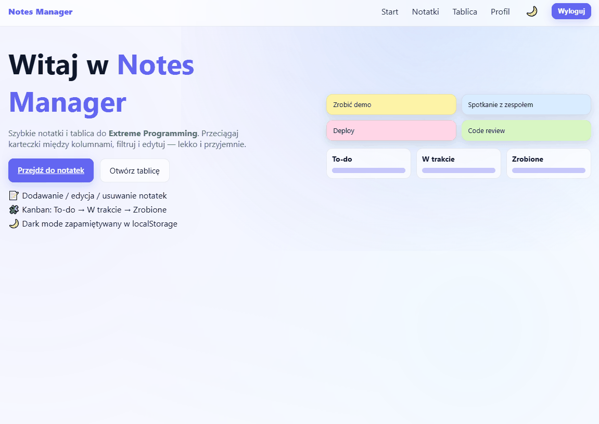

# 📝 Notes Manager

**Notes Manager** is a modern note-taking and task management app built with **React (frontend)** and **.NET 8 Web API (backend)**.  
It allows users to create, edit, and organize notes in a **Kanban-style board** with secure Auth0 authentication.

[](https://dotnet.microsoft.com/)
[](https://reactjs.org/)
[](https://vitejs.dev/)
[](https://www.mongodb.com/)
[](https://auth0.com/)

---

## 🚀 Features

- ✅ Create, edit, and delete notes  
- ✅ Kanban board with drag-and-drop  
- ✅ Secure authentication via **Auth0 (JWT Bearer)**  
- ✅ Persistent storage with **MongoDB**  
- ✅ Logging to file and console using **Serilog**  
- ✅ Clear architecture using **CQRS + MediatR**  
- ✅ Integrated Swagger UI for testing  

---

## 🧩 Tech Stack

| Layer | Technologies |
|--------|--------------|
| **Frontend** | React, Vite, TypeScript |
| **Backend** | ASP.NET Core (.NET 8), MediatR, MongoDB |
| **Authentication** | Auth0 (JWT) |
| **Logging** | Serilog |
| **Tools** | Swagger, CORS |

---

## 🧰 Getting Started

### 🗄️ Prerequisites
- **Node.js** ≥ 18  
- **.NET SDK** ≥ 8.0  
- **MongoDB** (local or cloud instance)
- **Auth0** tenant with API + SPA apps configured

---

### 🧩 Backend Setup
```bash
cd notes-backend/Auth0Mediator.Api
dotnet restore
dotnet run
```
---

### 🎨 Frontend Setup
```bash
cd notes-spa
npm install
npm run dev
```
---

## ⚙️ Environment Variables

### 🖥️ Frontend (`notes-spa/.env.local`)
```env
# Auth0
VITE_AUTH0_DOMAIN=YOUR_AUTH0_DOMAIN            # e.g. your-tenant.eu.auth0.com
VITE_AUTH0_CLIENT_ID=YOUR_DEV_CLIENT_ID
VITE_AUTH0_AUDIENCE=YOUR_API_IDENTIFIER        # e.g. https://api.your-app.local

# Backend API base URL
VITE_API_BASE_URL=http://localhost:5241

```
---

### 🧩 Backend (appsettings.Development.json)
```env
{
  "Serilog": {
    "MinimumLevel": {
      "Default": "Debug",
      "Override": {
        "Microsoft": "Warning",
        "Microsoft.Hosting.Lifetime": "Information"
      }
    },
    "Enrich": [ "FromLogContext" ],
    "WriteTo": [
      { "Name": "Console" },
      {
        "Name": "File",
        "Args": {
          "path": "logs/api.log",
          "rollingInterval": "Day",
          "retainedFileCountLimit": 14,
          "shared": true
        }
      }
    ]
  },

  "Logging": {
    "LogLevel": {
      "Default": "Debug",
      "Microsoft.AspNetCore": "Warning"
    }
  },

  "AllowedHosts": "*",

  "Auth0": {
    "Domain": "YOUR_AUTH0_DOMAIN",          // e.g. your-tenant.eu.auth0.com
    "Audience": "YOUR_API_IDENTIFIER",       // e.g. https://api.your-app.local
    "RoleClaim": "roles",
    "ClientId": "YOUR_DEV_CLIENT_ID",
    "ClientSecret": "YOUR_DEV_CLIENT_SECRET"
  },

  "MongoDB": {
    "ConnectionString": "YOUR_MONGODB_CONNECTION_STRING",  // e.g. mongodb://localhost:27017
    "DatabaseName": "YOUR_DEV_DATABASE_NAME"               // e.g. notes_manager_db_dev
  }
}

```
---

## 📡 API Endpoints

Below is a full list of backend endpoints used by the frontend.

---

### 🪣 Board Cards (`/api/board/cards`)

| Method | Endpoint | Description | Permission |
|:--------|:----------|:-------------|:-------------|
| `GET` | `/api/board/cards` | Get all Kanban cards | `read:cards` |
| `POST` | `/api/board/cards` | Create a new board card | `create:cards` |
| `PATCH` | `/api/board/cards/{id}` | Update existing card | `update:cards` |
| `DELETE` | `/api/board/cards/{id}` | Delete a card | `delete:cards` |
| `POST` | `/api/board/cards/{id}/move` | Move a card between columns | `update:cards` |
| `POST` | `/api/board/cards/reorder` | Reorder cards within a column | `update:cards` |

---

### 🗒️ Notes (`/api/notes`)

| Method | Endpoint | Description | Permission |
|:--------|:----------|:-------------|:-------------|
| `GET` | `/api/notes` | Get all notes for current user | `read:notes` |
| `POST` | `/api/notes` | Create a new note | `create:notes` |
| `PUT` | `/api/notes/{id}` | Update an existing note | `update:notes` |
| `DELETE` | `/api/notes/{id}` | Delete a note | `delete:notes` |

---

### 🧑‍💼 Admin (`/api/admin/...`)

| Method | Endpoint | Description | Permission |
|:--------|:----------|:-------------|:-------------|
| `GET` | `/api/admin/secret` | Access protected admin secret | `read:admin-secret` |
| `GET` | `/api/admin/users?q=&page=&pageSize=` | List Auth0 users | `read:admin-users` |
| `POST` | `/api/admin/users/{userId}/block` | Block or unblock Auth0 user | `update:admin-users` |
| `POST` | `/api/admin/users/{userId}/reset-password?resultUrl=` | Create password reset ticket | `reset:admin-passwords` |
| `GET` | `/api/admin/roles` | List all Auth0 roles | `read:admin-roles` |
| `GET` | `/api/admin/roles/{roleId}/permissions` | Get permissions for a role | `read:role_permissions` |
| `GET` | `/api/admin/users/{userId}/roles` | Get user roles | `read:admin-users` |
| `POST` | `/api/admin/users/{userId}/roles` | Assign roles to a user | `manage:admin-users` |
| `DELETE` | `/api/admin/users/{userId}/roles/{roleId}` | Remove role from a user | `manage:admin-users` |

---

### 👤 Profile (`/api/profile`)

| Method | Endpoint | Description | Permission |
|:--------|:----------|:-------------|:-------------|
| `GET` | `/api/profile` | Get current authenticated user's profile | `read:profile` |

---

✅ **All endpoints are protected via JWT (Auth0 Bearer Token).**  
Use `Authorization: Bearer <token>` in headers for authenticated access.

## 📁 Project Structure

This repository contains both **backend (ASP.NET API)** and **frontend (React SPA)** parts of the Notes Manager project.

---

### 🧩 Backend – `notes-backend/Auth0Mediator.Api`

```text
Auth0Mediator.Api
├── appsettings.Development.example.json   # Example config (Auth0, Mongo)
├── appsettings.json                       # Base configuration
├── Program.cs                             # Entry point & service registration
├── Auth0Mediator.Api.csproj               # Project file
│
├── Features/
│   ├── Admin/                             # Auth0 Management API integration
│   │   ├── AdminController.cs             # Endpoints for Auth0 admin ops
│   │   ├── Auth0MgmtService.cs            # Core logic for Auth0 Management
│   │   ├── Auth0MgmtTokenProvider.cs      # M2M token caching
│   │   ├── Auth0MgmtOptions.cs            # Settings binding class
│   │   └── Dtos.cs, IAuth0MgmtService.cs  # Interfaces & DTOs
│   │
│   ├── BoardCards/                        # Kanban board features
│   │   ├── BoardCardsController.cs        # API endpoints
│   │   ├── AddCard/, UpdateCard/, MoveCard/, Reorder/, DeleteCard/
│   │   │   # Each folder = MediatR command handler + DTO
│   │   ├── GetCards/                      # Query to fetch all cards
│   │   └── Persistence/                   # Mongo entities + repository
│   │
│   ├── Notes/                             # Notes CRUD operations
│   │   ├── NotesController.cs             # REST API for notes
│   │   ├── AddNote*, UpdateNote*, DeleteNote*  # Commands (CQRS)
│   │   ├── GetNotes*, GetNoteById*        # Queries
│   │   ├── NotesRepository.cs             # MongoDB access
│   │   └── NoteEntity.cs                  # Data model
│   │
│   ├── Profile/                           # Auth0 profile (user info)
│   │   ├── ProfileController.cs
│   │   ├── GetProfileHandler.cs / Query.cs
│   │   └── UserProfileDto.cs
│   │
│   └── Users/                             # Local user repository layer
│       ├── UsersRepository.cs
│       ├── IUsersRepository.cs
│       └── UserEntity.cs
│
├── Controllers/
│   └── HealthController.cs                # Optional health check endpoint
│
└── Properties/
    └── launchSettings.json
```
---

### 🎨 Frontend – `notes-spa/`
```text
notes-spa
├── .env.example               # Example environment variables (Auth0, API base URL)
├── .env.local                 # Local environment config (ignored by git)
├── .gitignore                 # Ignore rules for frontend
├── eslint.config.js           # ESLint configuration
├── index.html                 # Main HTML entry (Vite root)
├── package.json               # Dependencies and npm scripts
├── package-lock.json          # Locked dependency versions
├── tsconfig.json              # Global TypeScript configuration
├── tsconfig.app.json          # TS config for app source
├── tsconfig.node.json         # TS config for Vite/node
├── vite.config.ts             # Vite build & dev server configuration
│
├── public/
│   └── vite.svg               # Public static assets (copied as-is)
│
└── src/
    ├── api.ts                 # Axios/fetch client setup
    ├── endpoints.ts           # Central list of API endpoints
    ├── useApi.ts              # React hook for API calls
    ├── permissions.tsx        # Role/permission helper logic
    ├── RequireAuth.tsx        # Route guard component (Auth0 protection)
    ├── App.tsx                # Main React component
    ├── main.tsx               # ReactDOM root entry
    ├── index.css              # Global styles
    │
    ├── assets/
    │   └── react.svg          # Static React logo
    │
    ├── components/            # Reusable UI components
    │   ├── AddCardForm.tsx
    │   ├── AppBackground.tsx
    │   ├── AuthButtons.tsx
    │   ├── BoardColumn.tsx
    │   ├── CardItem.tsx
    │   └── Shell.tsx
    │
    └── pages/                 # Routed pages (React Router)
        ├── Admin.tsx          # Admin dashboard (users & roles)
        ├── Board.tsx          # Kanban board view
        ├── Home.tsx           # Landing page
        ├── Notes.tsx          # Notes list and editor
        └── Profile.tsx        # Auth0 user profile
```


# 🖼️ Showcase



